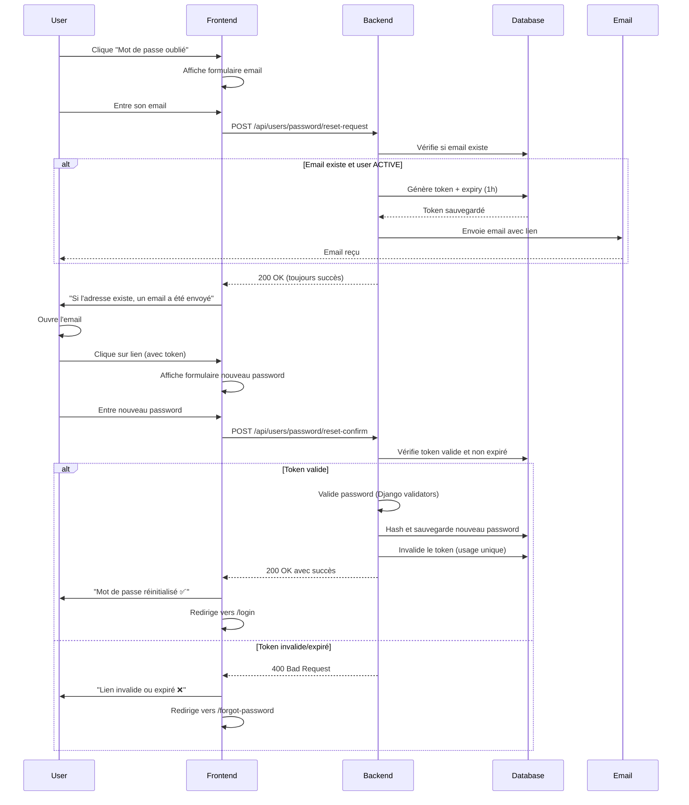

# Documentation API - Réinitialisation de Mot de Passe

## Vue d'ensemble

Cette API permet aux utilisateurs de réinitialiser leur mot de passe en deux étapes :
1. **Demande de réinitialisation** : L'utilisateur demande un lien de réinitialisation qui lui est envoyé par email
2. **Confirmation de réinitialisation** : L'utilisateur utilise le token du lien pour définir un nouveau mot de passe

## Sécurité et Limitations

| Caractéristique | Valeur | Description |
|-----------------|--------|-------------|
| **Expiration du token** | 1 heure | Le lien de réinitialisation expire après 1 heure |
| **Usage du token** | Usage unique | Le token est invalidé après utilisation réussie |
| **Rate limiting** | 3 requêtes/heure | Maximum 3 demandes par email par heure |
| **Authentification** | Aucune | Les endpoints sont publics (pas de JWT requis) |
| **Utilisateurs éligibles** | Status ACTIVE uniquement | Seuls les utilisateurs actifs reçoivent l'email |

---

## Endpoint 1 : Demande de Réinitialisation

### `POST /api/users/password/reset-request`

Envoie un email avec un lien de réinitialisation à l'utilisateur.

### Paramètres

**Headers :**
```http
Content-Type: application/json
```

**Body (JSON) :**
```json
{
  "email": "string (required, format email)"
}
```

| Champ | Type | Requis | Description |
|-------|------|--------|-------------|
| `email` | string | ✅ Oui | Adresse email de l'utilisateur |

### Réponses

#### ✅ Succès (200 OK)

**Retourné dans TOUS les cas** (email existe ou non) pour des raisons de sécurité.

```json
{
  "success": true,
  "message": "Si l'adresse email existe, un lien de réinitialisation a été envoyé.",
  "data": {},
  "errors": null,
  "code": null,
  "request_id": "abc-123-def"
}
```

**Note importante :**
- Le backend retourne toujours un succès même si l'email n'existe pas
- L'email est uniquement envoyé si :
  - ✅ L'email existe dans la base de données
  - ✅ L'utilisateur a le status `ACTIVE`
  - ✅ La limite de 3 requêtes par heure n'est pas dépassée
- Ceci empêche les attaquants de découvrir quels emails sont enregistrés

#### ❌ Erreur de validation (400 Bad Request)

Retourné si l'email est invalide (format incorrect).

```json
{
  "success": false,
  "message": "Validation error",
  "errors": {
    "email": ["Enter a valid email address."]
  },
  "code": null
}
```

### Exemple d'intégration Frontend

#### JavaScript Vanilla / Fetch API

```javascript
async function requestPasswordReset(email) {
  try {
    const response = await fetch('/api/users/password/reset-request', {
      method: 'POST',
      headers: {
        'Content-Type': 'application/json',
      },
      body: JSON.stringify({ email })
    });

    const data = await response.json();

    if (response.ok) {
      // Toujours un succès - afficher le message
      console.log('Success:', data.message);
      return { success: true, message: data.message };
    } else {
      // Erreur de validation
      console.error('Validation error:', data.errors);
      return { success: false, errors: data.errors };
    }
  } catch (error) {
    console.error('Network error:', error);
    return { success: false, error: 'Erreur réseau' };
  }
}

// Utilisation
requestPasswordReset('user@example.com')
  .then(result => {
    if (result.success) {
      alert(result.message);
      // Rediriger vers page de confirmation
      window.location.href = '/reset-password-sent';
    }
  });
```

#### React / Axios

```jsx
import axios from 'axios';
import { useState } from 'react';

function PasswordResetRequestForm() {
  const [email, setEmail] = useState('');
  const [loading, setLoading] = useState(false);
  const [message, setMessage] = useState('');
  const [error, setError] = useState('');

  const handleSubmit = async (e) => {
    e.preventDefault();
    setLoading(true);
    setError('');
    setMessage('');

    try {
      const response = await axios.post('/api/users/password/reset-request', {
        email
      });

      // Toujours un succès
      setMessage(response.data.message);

      // Redirection après 3 secondes
      setTimeout(() => {
        window.location.href = '/login';
      }, 3000);

    } catch (err) {
      if (err.response?.data?.errors) {
        setError('Adresse email invalide');
      } else {
        setError('Une erreur est survenue. Veuillez réessayer.');
      }
    } finally {
      setLoading(false);
    }
  };

  return (
    <form onSubmit={handleSubmit}>
      <h2>Mot de passe oublié ?</h2>
      <p>Entrez votre adresse email pour recevoir un lien de réinitialisation.</p>

      <input
        type="email"
        value={email}
        onChange={(e) => setEmail(e.target.value)}
        placeholder="votre.email@example.com"
        required
        disabled={loading}
      />

      <button type="submit" disabled={loading}>
        {loading ? 'Envoi en cours...' : 'Envoyer le lien'}
      </button>

      {message && (
        <div className="success-message">
          ✅ {message}
          <p>Vérifiez votre boîte mail (et les spams).</p>
        </div>
      )}

      {error && (
        <div className="error-message">❌ {error}</div>
      )}
    </form>
  );
}

export default PasswordResetRequestForm;
```

### Recommandations UX

1. **Message de succès** : Toujours afficher un message positif même si l'email n'existe pas
2. **Vérification spam** : Rappeler à l'utilisateur de vérifier ses spams
3. **Expiration** : Mentionner que le lien expire dans 1 heure
4. **Rate limiting** : Informer l'utilisateur s'il fait trop de demandes
5. **Lien retour** : Proposer un lien pour retourner à la page de connexion

---

## Endpoint 2 : Confirmation de Réinitialisation

### `POST /api/users/password/reset-confirm`

Réinitialise le mot de passe avec le token reçu par email.

### Paramètres

**Headers :**
```http
Content-Type: application/json
```

**Body (JSON) :**
```json
{
  "token": "string (required)",
  "new_password": "string (required, min 8 caractères)"
}
```

| Champ | Type | Requis | Validation | Description |
|-------|------|--------|------------|-------------|
| `token` | string | ✅ Oui | Non vide | Token extrait du lien email |
| `new_password` | string | ✅ Oui | Min 8 caractères | Nouveau mot de passe |

**Règles de validation du mot de passe :**
- ✅ Minimum 8 caractères
- ✅ Ne doit pas être trop similaire aux informations de l'utilisateur
- ✅ Ne doit pas être un mot de passe courant
- ✅ Ne doit pas être entièrement numérique

### Réponses

#### ✅ Succès (200 OK)

Mot de passe réinitialisé avec succès.

```json
{
  "success": true,
  "message": "Votre mot de passe a été réinitialisé avec succès.",
  "data": {
    "user": {
      "email": "user@example.com",
      "full_name": "Jean Dupont"
    }
  },
  "errors": null,
  "code": null,
  "request_id": "abc-123-def"
}
```

#### ❌ Token Invalide ou Expiré (400 Bad Request)

```json
{
  "success": false,
  "message": "Le lien de réinitialisation est invalide ou a expiré.",
  "data": {},
  "errors": null,
  "code": "RESET_TOKEN_INVALID",
  "request_id": "abc-123-def"
}
```

**Causes possibles :**
- Token n'existe pas dans la base de données
- Token a expiré (> 1 heure)
- Token déjà utilisé (usage unique)
- Token a été remplacé par une nouvelle demande

#### ❌ Mot de Passe Non Valide (400 Bad Request)

```json
{
  "success": false,
  "message": "Le mot de passe ne respecte pas les critères de sécurité: This password is too common. This password is entirely numeric.",
  "data": {},
  "errors": null,
  "code": "PASSWORD_VALIDATION_FAILED",
  "request_id": "abc-123-def"
}
```

**Messages d'erreur Django possibles :**
- `"This password is too short. It must contain at least 8 characters."`
- `"This password is too common."`
- `"This password is entirely numeric."`
- `"The password is too similar to the email."`

#### ❌ Validation Frontend (400 Bad Request)

Si le mot de passe a moins de 8 caractères (validation Pydantic).

```json
{
  "success": false,
  "message": "Validation error",
  "errors": {
    "new_password": ["Le mot de passe doit contenir au moins 8 caractères"]
  },
  "code": null
}
```

### Exemple d'intégration Frontend

#### JavaScript Vanilla / Fetch API

```javascript
// Extraire le token de l'URL
const urlParams = new URLSearchParams(window.location.search);
const token = urlParams.get('token');

async function resetPassword(token, newPassword) {
  try {
    const response = await fetch('/api/users/password/reset-confirm', {
      method: 'POST',
      headers: {
        'Content-Type': 'application/json',
      },
      body: JSON.stringify({
        token,
        new_password: newPassword
      })
    });

    const data = await response.json();

    if (response.ok) {
      console.log('Password reset successful:', data);
      return {
        success: true,
        message: data.message,
        user: data.data?.user
      };
    } else {
      console.error('Reset failed:', data);
      return {
        success: false,
        message: data.message,
        code: data.code
      };
    }
  } catch (error) {
    console.error('Network error:', error);
    return {
      success: false,
      message: 'Erreur réseau. Veuillez réessayer.'
    };
  }
}

// Utilisation
resetPassword(token, 'NewSecurePassword123!')
  .then(result => {
    if (result.success) {
      alert('✅ ' + result.message);
      // Rediriger vers la page de connexion
      window.location.href = '/login?reset=success';
    } else {
      alert('❌ ' + result.message);

      // Gérer les codes d'erreur spécifiques
      if (result.code === 'RESET_TOKEN_INVALID') {
        // Token expiré - proposer de redemander un lien
        window.location.href = '/forgot-password?expired=true';
      }
    }
  });
```

#### React / Axios

```jsx
import axios from 'axios';
import { useState, useEffect } from 'react';
import { useSearchParams, useNavigate } from 'react-router-dom';

function PasswordResetConfirmForm() {
  const [searchParams] = useSearchParams();
  const navigate = useNavigate();

  const [token, setToken] = useState('');
  const [password, setPassword] = useState('');
  const [confirmPassword, setConfirmPassword] = useState('');
  const [loading, setLoading] = useState(false);
  const [error, setError] = useState('');
  const [passwordStrength, setPasswordStrength] = useState('');

  useEffect(() => {
    const tokenParam = searchParams.get('token');
    if (!tokenParam) {
      setError('Token de réinitialisation manquant');
      return;
    }
    setToken(tokenParam);
  }, [searchParams]);

  // Vérifier la force du mot de passe
  const checkPasswordStrength = (pwd) => {
    if (pwd.length < 8) return 'Trop court';
    if (pwd.length < 10) return 'Faible';
    if (!/\d/.test(pwd)) return 'Moyen (ajoutez des chiffres)';
    if (!/[A-Z]/.test(pwd)) return 'Moyen (ajoutez des majuscules)';
    if (!/[!@#$%^&*]/.test(pwd)) return 'Bon (ajoutez des symboles pour "Fort")';
    return 'Fort';
  };

  const handlePasswordChange = (e) => {
    const pwd = e.target.value;
    setPassword(pwd);
    setPasswordStrength(checkPasswordStrength(pwd));
  };

  const handleSubmit = async (e) => {
    e.preventDefault();
    setError('');

    // Validation frontend
    if (password !== confirmPassword) {
      setError('Les mots de passe ne correspondent pas');
      return;
    }

    if (password.length < 8) {
      setError('Le mot de passe doit contenir au moins 8 caractères');
      return;
    }

    setLoading(true);

    try {
      const response = await axios.post('/api/users/password/reset-confirm', {
        token,
        new_password: password
      });

      // Succès
      alert('✅ ' + response.data.message);

      // Redirection vers login
      navigate('/login?reset=success');

    } catch (err) {
      const errorData = err.response?.data;

      if (errorData?.code === 'RESET_TOKEN_INVALID') {
        setError('Ce lien de réinitialisation est invalide ou a expiré. Veuillez demander un nouveau lien.');
        setTimeout(() => navigate('/forgot-password'), 3000);
      } else if (errorData?.code === 'PASSWORD_VALIDATION_FAILED') {
        setError(errorData.message);
      } else {
        setError('Une erreur est survenue. Veuillez réessayer.');
      }
    } finally {
      setLoading(false);
    }
  };

  if (!token) {
    return (
      <div className="error-container">
        <h2>❌ Lien invalide</h2>
        <p>Ce lien de réinitialisation est invalide.</p>
        <button onClick={() => navigate('/forgot-password')}>
          Demander un nouveau lien
        </button>
      </div>
    );
  }

  return (
    <form onSubmit={handleSubmit}>
      <h2>Réinitialiser votre mot de passe</h2>

      <div className="form-group">
        <label htmlFor="password">Nouveau mot de passe</label>
        <input
          id="password"
          type="password"
          value={password}
          onChange={handlePasswordChange}
          placeholder="Minimum 8 caractères"
          required
          disabled={loading}
        />
        {password && (
          <div className={`password-strength ${passwordStrength.toLowerCase()}`}>
            Force : {passwordStrength}
          </div>
        )}
      </div>

      <div className="form-group">
        <label htmlFor="confirmPassword">Confirmer le mot de passe</label>
        <input
          id="confirmPassword"
          type="password"
          value={confirmPassword}
          onChange={(e) => setConfirmPassword(e.target.value)}
          placeholder="Retapez votre mot de passe"
          required
          disabled={loading}
        />
      </div>

      <div className="password-requirements">
        <p>Le mot de passe doit :</p>
        <ul>
          <li className={password.length >= 8 ? 'valid' : ''}>
            ✓ Contenir au moins 8 caractères
          </li>
          <li className={/[A-Z]/.test(password) ? 'valid' : ''}>
            ✓ Contenir au moins une majuscule
          </li>
          <li className={/\d/.test(password) ? 'valid' : ''}>
            ✓ Contenir au moins un chiffre
          </li>
          <li>✓ Ne pas être un mot de passe courant</li>
        </ul>
      </div>

      <button type="submit" disabled={loading || !password || !confirmPassword}>
        {loading ? 'Réinitialisation...' : 'Réinitialiser le mot de passe'}
      </button>

      {error && (
        <div className="error-message">❌ {error}</div>
      )}

      <p className="help-text">
        Ce lien expire dans 1 heure et ne peut être utilisé qu'une seule fois.
      </p>
    </form>
  );
}

export default PasswordResetConfirmForm;
```

---

## Flux Complet d'Utilisation



---

## Email Envoyé à l'Utilisateur

Le lien dans l'email aura ce format :

```
https://votre-domaine.com/reset-password?token=Abc123XYZ456DefGHI789...
```

### Exemple de contenu email :

```html
Bonjour Jean,

Vous avez demandé la réinitialisation de votre mot de passe pour DID Annuaire.

Cliquez sur le bouton ci-dessous pour créer un nouveau mot de passe :

[Réinitialiser mon mot de passe]

Ce lien expire dans 1 heure.

Si vous n'avez pas demandé cette réinitialisation, ignorez cet email.
Votre mot de passe restera inchangé.
```

---

## Codes d'Erreur Récapitulatifs

| Code | Message | Cause | Action Frontend |
|------|---------|-------|-----------------|
| `null` | Validation error | Format email invalide | Afficher erreur de validation |
| `RESET_TOKEN_INVALID` | Le lien... est invalide ou a expiré | Token n'existe pas / expiré / déjà utilisé | Proposer de redemander un lien |
| `PASSWORD_VALIDATION_FAILED` | Le mot de passe ne respecte pas... | Password trop faible | Afficher critères de validation |

---

## Configuration Frontend Requise

### 1. Variables d'Environnement

```env
# .env
VITE_API_URL=https://api.votre-domaine.com
# ou
REACT_APP_API_URL=https://api.votre-domaine.com
```

### 2. Configuration Axios (optionnel mais recommandé)

```javascript
// src/api/axios.js
import axios from 'axios';

const api = axios.create({
  baseURL: process.env.VITE_API_URL || 'http://localhost:8000',
  headers: {
    'Content-Type': 'application/json',
  }
});

// Intercepteur pour gérer les erreurs globalement
api.interceptors.response.use(
  response => response,
  error => {
    if (error.response?.status === 500) {
      console.error('Server error:', error);
      alert('Erreur serveur. Veuillez contacter le support.');
    }
    return Promise.reject(error);
  }
);

export default api;
```

### 3. Routes React Router (exemple)

```javascript
// App.js
import { BrowserRouter, Routes, Route } from 'react-router-dom';
import ForgotPassword from './pages/ForgotPassword';
import ResetPassword from './pages/ResetPassword';
import Login from './pages/Login';

function App() {
  return (
    <BrowserRouter>
      <Routes>
        <Route path="/login" element={<Login />} />
        <Route path="/forgot-password" element={<ForgotPassword />} />
        <Route path="/reset-password" element={<ResetPassword />} />
      </Routes>
    </BrowserRouter>
  );
}

export default App;
```

---

## Tests Recommandés

### Tests Frontend à Effectuer

1. **Test nominal complet**
   - Demander réinitialisation avec email valide
   - Recevoir email
   - Cliquer sur lien
   - Réinitialiser password
   - Se connecter avec nouveau password

2. **Email invalide/inexistant**
   - Vérifier message de succès s'affiche quand même
   - Vérifier qu'aucun email n'est reçu

3. **Token expiré**
   - Attendre 1h+ après demande
   - Tenter de réinitialiser
   - Vérifier message d'erreur approprié

4. **Token déjà utilisé**
   - Réinitialiser password avec succès
   - Tenter de réutiliser le même lien
   - Vérifier erreur "token invalide"

5. **Rate limiting**
   - Faire 4 demandes rapides
   - Vérifier que seules 3 sont traitées

6. **Validation password**
   - Tester avec password < 8 caractères
   - Tester avec password trop courant ("password123")
   - Tester avec password entièrement numérique

---

## Exemples de Messages UX

### Page "Mot de passe oublié"

**Titre :** Mot de passe oublié ?

**Description :** Entrez votre adresse email et nous vous enverrons un lien pour réinitialiser votre mot de passe.

**Placeholder input :** votre.email@example.com

**Bouton :** Envoyer le lien

**Message de succès :**
```
✅ Si l'adresse email existe, un lien de réinitialisation a été envoyé.

Vérifiez votre boîte mail (et vos spams).
Le lien expire dans 1 heure.
```

### Page "Réinitialiser le mot de passe"

**Titre :** Réinitialiser votre mot de passe

**Description :** Entrez votre nouveau mot de passe ci-dessous.

**Label input 1 :** Nouveau mot de passe

**Label input 2 :** Confirmer le mot de passe

**Bouton :** Réinitialiser le mot de passe

**Message de succès :**
```
✅ Votre mot de passe a été réinitialisé avec succès !

Vous allez être redirigé vers la page de connexion...
```

**Message d'erreur (token invalide) :**
```
❌ Ce lien de réinitialisation est invalide ou a expiré.

[Demander un nouveau lien]
```

---

## Support et Questions

Pour toute question sur l'intégration, contactez l'équipe backend ou consultez :
- Swagger UI : `http://localhost:8000/api/docs`
- Code source backend : `src/users/apis.py` (lignes 286-329)

---

**Version :** 1.0
**Date :** 16 février 2026
**Auteur :** Équipe Backend DID Annuaire
